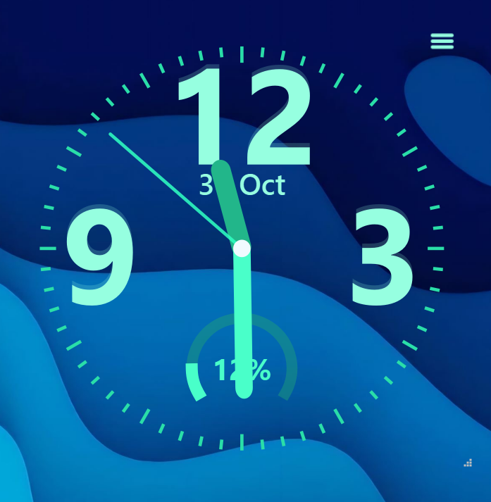

# 🕒 PyQt6 Analog Clock

A **frameless, modern analog clock application** built with **PyQt6**, featuring real-time hands, date display, and a dynamic battery indicator — all wrapped in a clean, minimal UI.




---

## ✨ Features

### 🕰️ Real-time Clock
- Smoothly moving **hour**, **minute**, and **second** hands.
- High refresh rate for a fluid, elegant motion.

### 🔋 Battery Indicator
- Circular **battery ring** around the clock.
- Automatically detects battery level and charging status.
- Dynamic color change for charging/discharging.

### 📅 Date & Timezone
- Displays **current date**, **day**, and **month**.
- Built-in **timezone support** using Python’s `zoneinfo`.

### 🎨 Custom Themes
- Modify **colors**, **font styles**, and **tick spacing** directly in the code.
- Easily adapt the theme to match your desktop setup.

### 🪟 Window Management
- **Frameless**, **draggable** window design.
- Optional **Always-on-Top** mode.
- **System tray integration** for background operation.

---

## 🧰 Requirements

| Component | Version |
|------------|----------|
| Python     | 3.9 or later |
| PyQt6      | 6.7+ |
| psutil     | 6.0+ |
| tzdata     | Latest |

---

## 📦 Installation

1. **Clone or download** this repository:
   ```bash
   git clone https://github.com/nishanknishankkhadpe7-afk/PyQt6-Analog-Clock.git
   cd PyQt6-Analog-Clock
   ```

2. **Install dependencies**:
   ```bash
   pip install -r requirements.txt
   ```

   *(This will automatically install `PyQt6`, `psutil`, and `tzdata`.)*

---

## 🚀 Running the Application

Once dependencies are installed, simply run:

```bash
python app.py
```

The analog clock will launch with your **local time**, **date**, and **battery status**.

---

## 🗂️ Project Structure

```
CLOCK/
│
├─ app.py                    # Main application file
├─ requirements.txt   # Dependencies list
└─ README.md       # Project documentation
```

---

## ⚙️ Configuration

All customizable parameters (such as **colors**, **font sizes**, **ring thickness**, and **tick spacing**) are defined in the `WatchWidget` class within `app.py`.

You can easily tweak the theme by editing:
```python
self.bg_color = QColor(20, 20, 20)
self.hour_color = QColor("#FFD700")
self.minute_color = QColor("#00BFFF")
self.second_color = QColor("#FF4500")
```

---

## 🧭 Timezone Handling

The application uses Python’s built-in `zoneinfo` module for robust timezone management.  
You can adjust the clock to display a **custom timezone** by setting:

```python
self.timezone = ZoneInfo("Asia/Kolkata")
```

---

## 🧪 Tested Environment

| Platform | Version |
|-----------|----------|
| OS | Windows 10 / 11 |
| Python | 3.10 – 3.12 |
| Libraries | PyQt6 6.7+, psutil 6.0+ |

---

## 👨‍💻 Author

**Nishank**  
AI & DS Engineer & Developer  

💡 *“Time is not measured by clocks, but by moments.”*

---


### ⭐ If you like this project, consider giving it a star on GitHub!
